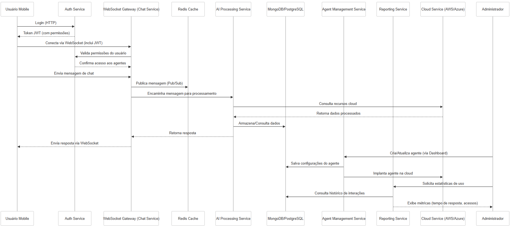
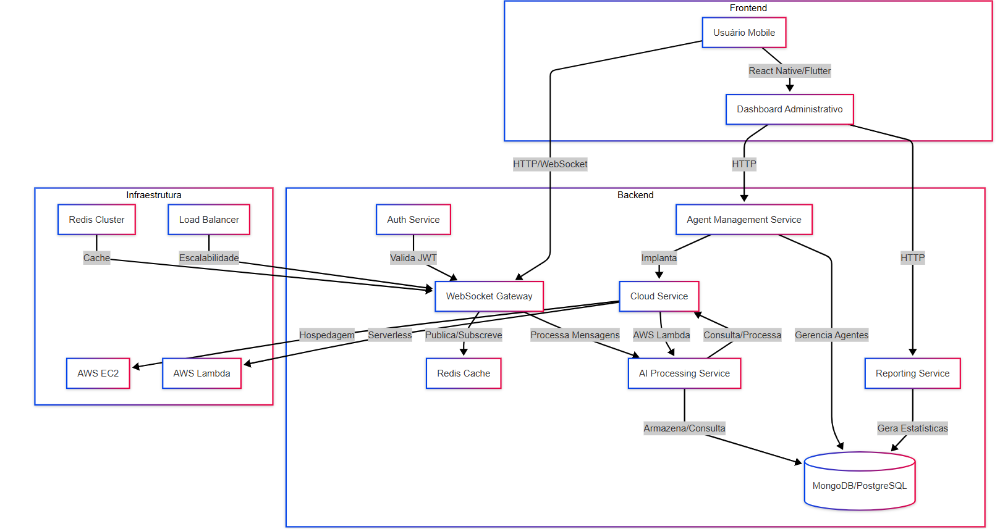

 

<h1 align="center">API 2025.1 - Banana Script</h1>
 

     <a href="#sobre">Sobre</a> •
     <a href="#tecnologias">Ferramentas e Tecnologias</a> •
     <a href="#entregas">Entregas</a> • 
     <a href="#backlog">Backlogs e User Stories</a> •
     <a href="#documentacao">Documentação</a> •
     <a href="#equipe">Equipe</a> 

# 👋Hello! Nós somos o grupo BananaScript
Nós somos estudantes da <a href='https://fatecsjc-prd.azurewebsites.net/'>FATEC de São José dos Campos</a> e estamos no 5º semestre de Desenvolvimento de Software e multiplataformas.

### Sobre o projeto:

Atualmente, empresas de tecnologia enfrentam desafios na disseminação de conhecimento sobre 
seus próprios produtos, sistemas e processos internos. Muitas vezes, usuários internos e clientes 
precisam de suporte para entender funcionalidades de sistemas, regras de negócio ou fluxos 
operacionais. No entanto, centralizar esse conhecimento em poucos especialistas pode gerar 
gargalos e atrasos nas respostas.

Pensando nisso, este projeto tem como objetivo o desenvolvimento de uma plataforma de criação 
e gerenciamento de agentes de Inteligência Artificial. A ferramenta permitirá que administradores 
criem múltiplos agentes virtuais personalizados, treinados para responder dúvidas específicas sobre 
diferentes sistemas e processos internos da empresa. Além disso, a solução deve contar com um 
sistema de permissões, onde cada usuário terá acesso apenas aos agentes aos quais foi autorizado.

Os alunos deverão desenvolver um aplicativo móvel que possibilite a interação com esses agentes 
por meio de um chat inteligente, garantindo que cada usuário visualize apenas as conversas e 
respostas dos agentes aos quais possui permissão de acesso. A aplicação deve ser integrada a um 
banco de dados na nuvem para armazenamento das interações e permitir o gerenciamento 
eficiente dos agentes e permissões.

### Apresentação do problema:

#### Desenvolvimento de uma Plataforma Móvel para Criação e Gerenciamento de Agentes de Inteligência Artificial para Atendimento Interno

 

## Link dos repositórios

Link do repositório do Front-end: <a href="https://github.com/BananaScripts/API_5-Semester-Frontend">https://github.com/BananaScripts/API_5-Semester-Frontend</a>

Link do repositório do Back-end: <a href="https://github.com/BananaScripts/API_5-Semester-Backend">https://github.com/BananaScripts/API_5-Semester-Backend</a>

 #### Status do projeto: Em Desenvolvimento

  
 
 
 
 ### Ferramentas e Tecnologias⚒️
 

  
  
  
  
  
  

 

  
 
  
  
  

 

  
  
  
 

  
 

### Entregas✅

Período | Data | Status  |
--------------|------| --------|
Kickoff | 25.02.2025 - 07.03.2025 | ✅ |
Sprint 01 | 10.03.2025 - 30.03.2025 | Em Andamento |
Sprint Review | 31.03.2025 - 04.04.2025 | Não Iniciado |
Sprint 02 | 07.04.2025 - 27.04.2025 | Não Iniciado |
Sprint Review | 28.04.2025 - 02.05.2025 | Não Iniciado |
Sprint 03 | 05.05.2025 - 25.05.2025 | Não Iniciado |
Feira de Soluções | 29.05.2025 | Não Iniciado |

## MVPs (Minimum Viable Product)

#### Sprint 01 | 10.03 - 30.03

Desenvolvimento da Aplicação Móvel com Chat (Sem os Agentes Implementados)

 

#### Sprint 02 | 07.04 - 27.04

Desenvolvimento e Implementação do Sistema de Criação e Gerenciamento dos Agentes de IA

 

#### Sprint 03 | 05.05 - 25.05

Desenvolviemnto dos Dashboards e do Histórico, além do Aprimoramento dos Agentes de IA 

 

## Requisitos

### Requisitos Funcionais

| **ID** | **Requisitos Funcionais**                                                           | **Prioridade** |
|--------|-------------------------------------------------------------------------------------|----------------|
| RF_1 | Permitir o cadastro de agentes de IA com conteúdos personalizados (ex.: um agente para responder dúvidas sobre um sistema de RH, outro para um ERP, etc.) | 2 |
| RF_2 | Implementar um sistema de chat, onde os usuários possam interagir com os agentes para esclarecer dúvidas | 1 |
| RF_3 | Criar um sistema de permissões, onde o administrador possa definir quais agentes cada usuário pode acessar | 1 |
| RF_4 | Armazenar o histórico de interações entre usuários e agentes em um banco de dados na nuvem | 3 |
| RF_5 | Desenvolver um dashboard administrativo para gerenciar os agentes, permissões e visualizar estatísticas de uso | 3 |

### Requisitos Não Funcionais

| **ID** | **Requisitos Não Funcionais**                                         |
|--------|-----------------------------------------------------------------------|
| RNF_1 | Utilizar ReactNative ou Flutter para o desenvolvimento do aplicativo móvel. |
| RNF_2 | Implementar a persistência de dados em um banco de dados compatível (MySQL, MongoDB, Oracle, etc.). |
| RNF_3 | Assegurar um tempo de resposta adequado para as interações no chat. |
| RNF_4 | Criar uma documentação técnica com instruções de instalação, uso e estrutura da API. |
| RNF_5 | Proporcionar uma experiência fluida ao usuário, com interações naturais e rápidas. |
| RNF_6 | Possuir uma interface intuitiva e acessível. |

 

## Product Backlog 📖

| **ID** | **Requsitos** | **Item**                                                                                               | **Prioridade** |
|---------------|--------|--------------------------------------------------------------------------------------------------------|----------------|
| BCK_1 | RNF_1, RNF_5, RNF_6 | Estrutura do Aplicativo Móvel. | 1 |
| BCK_2 | RNF_2 | Implementação do Aplicativo e seus Serviços em Nuvem ( Cloud Service). | 1 |
| BCK_3 | RNF_4 | Definição e Aplicação dos Padrões de DevOps Definidos. | 1 | 
| BCK_4 | RF_2 | Sistema de Chat entre um Usuário e um Agente de IA ( WebSocket Gateway). | 1 |
| BCK_5 | RF_5 | Sistema de Gerenciamento de Usuários ( Agent Management Service). | 1 |
| BCK_6 | RF_5 | Sistema de Login e Autenticação ( Auth Service). | 1 |
| BCK_7 | RF_5 | Sistema de Gerenciamento de Agentes de IAs ( Agent Management Service). | 2 |
| BCK_8 | RF_1, RNF_3 | Sistema de Configuração e criação de Agentes de IA ( AI Processing Service). | 2 |
| BCK_9 | RF_3 | Sistema de Permissão de Usuários e Agentes de IA ( Agent Management Service ). | 2 |
| BCK_10 | RF_4 | Sistema de Histórico dos Chats (Redis) | 3 |
| BCK_11 | RF_5 | Sistema de Dashboards dos Chats (Dashboards Administrativos) | 3 |

 

## User Stories 📖

| **ID dos Requisitos** | **ID Product Backlog** | **User Stories**                                                                                                              |
|-----------------------|------------------------|-------------------------------------------------------------------------------------------------------------------------------|
| RF_3, RF_5 | BCK_6, BCK_9 | Eu, enquanto usuário do sistema, quero poder acessar uma conta já criada pelo administrador por meio do e-mail e senha.|
| RNF_1, RNF_2, RNF_5, RNF_6, RF_2 | BCK_1, BCK_2, BCK_4 | Eu, enquanto usuário público do sistema, quero poder ter acesso á aplicação e buscar chats onde posso buscar as respostas que preciso.|
| RF_2 | BCK_4 | Eu, enquanto usuário público do sistema, quero poder acessar varias opções de chat, com vários contextos diferentes, onde poderei descobrir oque preciso por meio da conversa com um Agente.|
| RF_2 | BCK_4 | Eu, enquanto usuário público do sistema, quero poder ter uma conversa normal, eficiente e rápida com um Agente.|
| RF_5 | BCK_10 | Eu, enquanto usuário cadastrado do sistema, quero poder acessar o histórico das conversas que já tive com os Agentes de IA.|
| RF_3, RF_5 | BCK_6, BCK_9 | Eu, enquanto usuário cadastrado, quero poder ter acesso a chats com informações internas a empresa, de acordo com meu nível de privilégio.|
| RF_5 | BCK_5, BCK_7 | Eu, enquanto administrador, quero poder gerenciar (criar, deletar e alterar) usuários e configurar Agentes.|
| RF_3 | BCK_9 | Eu, enquanto administrador, quero poder definir e remover permissões de usuários cadastrados e Agentes.|
| RF_5 | BCK_11 |Eu, enquanto administrador, quero poder ter acesso a dashboards com estatísticas de uso das conversas entre os usuários e Agentes.|
| RF_1 | BCK_8 | Eu, enquanto administrador, quero poder configurar novos e alterar antigos agentes.|

 

## Tarefas das Sprints

### Sprint 01 | 10.03 - 30.03 

| **ID** | **ID do Backlog** | **Titulo** | **Descrição**                                                                                     |
|--------|-------------------|------------|---------------------------------------------------------------------------------------------------|
| 1 | BCK_1 | (Frontend) Desenvolvimento da Estrutura do Aplicativo | Desenvolver a estrutura do aplicativo, ou seja, criar o projeto e desenvolver a barra de navegação funcional, além de iniciar a aplicação react. |
| 2 | BCK_4 | (Frontend) Desenvolvimento da Interface do Chat | Desenvolver a interface do chat, de forma que o chat permaneça estilizado durante a conversa. |
| 3 | BCK_5 | (Frontend) Desenvolvimento da Interface dos Administradores | Desenvolver a interface de gerenciamento dos usuários, com as funcionalidades de um CRUD padrão.  |
| 4 | BCK_6 | (Frontend) Desenvolvimento da Interface de Login | Desenvolver a interface de login junto do acesso á essa interface. |
| 5 | BCK_5 | (Frontend) Implementação do Sistema de Gerenciamento de Usuários | Implementar sistema de gerenciamento de usuários desenvolvido no backend á interface do administrador. |
| 6 | BCK_6 | (Frontend) Impelmentação do Sistema de Autenticação | Implementar sistema de autenticação, incluindo a criação de token, á interface do login. |
| 7 | BCK_4 | (Frontend) Implementação do Chat | Implementar Chat sem os agentes de IA presente no backend na interface do chat. |
| 8 | BCK_2 | (Frontend) Implementação do Frontend na Nuvem AWS| Fazer o deploy do frontend da aplicação na nuvem, por meio da AWS. |
| 9 | BCK_5 | (Backend) Desenvolvimento do Sistema de Gerenciamento de Usuários | Desenvolver sistema que faz um CRUD padrão na entidade de usuários. |
| 10 | BCK_6 | (Backend) Desenvolvimento do Sistema de Autenticação | Desenvolviemnto do sistema de autenticação que será implementado no sistema. |
| 11 | BCK_4 | (Backend) Desenvolvimento do Chat | Desenvolvimento de um sistema que permita a conversa entre um usuário e um agente  |
| 12 | BCK_2 | (Backend) Desenvolvimento do Banco de Dados | Desenvolvimento do banco de dados do sistema e conexão com os serviços do Backend. |
| 13 | BCK_8 | (Backend) Estudo Sobre Agentes de IA e suas Ferramentas | Estudos necessários para a próxima Sprint sobre o desenvolvimento de Agentes que supram as necessidades do cliente. |
| 14 | BCK_1 | (Backend) Desenvolvimento e Organização da base do Backend | Inicialização da aplicação em C# e organização dos serviços e sistemas do Backend |
| 15 | BCK_2 | (Backend) Implementação do Backend na Nuvem AWS | Fazer o deploy do servidor da aplicação na nuvem, por meio da AWS. |
| 16 | BCK_3 | (Geral) Definição de Padrões DevOps do Projeto | Definição dos padrões do projeto que serão seguidos nessa e nas próximas sprints. |

 

## DoD e DoR
|DoR (Definition of Ready) | DoD (Definition of Done) |
|-------------------------|---------------------------|
| As Tasks e as User Stories devem estar claras e possuirem uma descrição. | A funcionalidade deve ter sido aplicada na branch development via Pull request |
| A interface ou sistema a ser feito deve ser apresentado pelo protótipo ou pela arquitetura na Task. | A funcionalidade deve estar implementada em conjunto ao resto do sistema. |
| Oque é necessário para o desenvolvimento da Task já deve estar completo ou sendo finalizado. | A funcionalidade que será implementada não deve interromper outra já desenvolvida. |

 ### Documentação📄

<h2>📑Link para a Documentação do projeto:</h4>

<a href="https://github.com/BananaScripts/API_5-Semester/wiki/Documentation"> 📂/Documentação do projeto</a>

<h4>Diagrama de Sequencia</h4>

 
<h4>Arquitetura do Projeto</h4>

 

<h4> Rotas </h4>
Todas as rotas estão documentadas no swagger, aqui está o link:

 

### Equipe👨‍💻:

| Nome | LinkedIn | Github |
|:-----:|:----------:|:---------:|
| Bruno Fernandes ||
| Douglas Medeiros ||
| Kaue Riki ||
| Miguel Conde ||
| Antonio Alexandre ||

 

> Instituição: Fatec São José dos Campos - Prof. Jessen Vidal
> 
> Curso: Desenvolvimento de Software Multiplataforma/5º Semestre
 
 
 
<a href="#inicio">[Voltar ao início]</a>
